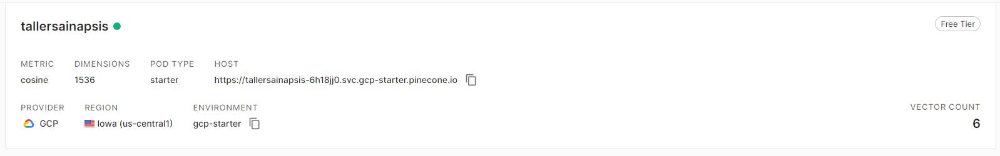
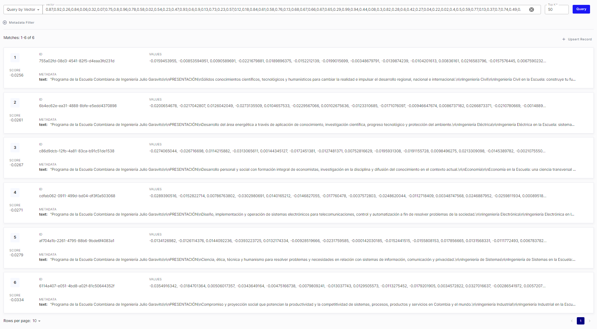

# Tarea de LLM
### Cristian Camilo Ruiz Santa

## Indice creado en Pinecone:

## Vectores creados en Pinecone al subir los archivos de texto:

## Respuesta del programa ante una pregunta:
Al ejecutar `pineconeCode.py` el programa responde con el contenido del archivo de texto correspondiente cargado a los vectores en Pinecone, en este caso se le hace una pregunta relacionada a la ingeniería de sistemas y responde con el vector que habla sobre la ingeniería de sistemas
> **_NOTA:_** La prueba se hizo al momento del desarrollo pero se olvidó sacar captura de la respuesta y el API KEY de Open AI se venció, motivo por el cuál no se agrega esta captura pero el programa responde como se solicita en el desafío 
